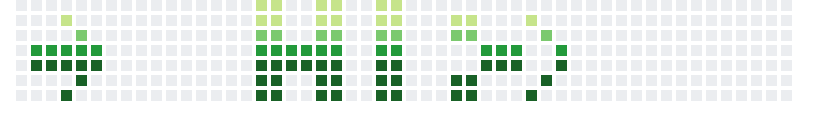

# Hi my name is Dirk, aka Lapsus

i am a freelance software developer and architect, father and husband.

 
---

## Connect with me
[ My Website](https://www.dirk-benkert.de) 
[ Xing](https://www.xing.com/profile/Dirk_Benkert2/cv)  
[ Twitter](https://twitter.com/lapsus75)

## Languages and Tools
          

          

      

## Offline
Besides work i enjoy the outdoors, rock climbing and volleyball (as a coach and player), Starcraft 2, playing guitar and pen&paper roleplaying games.
